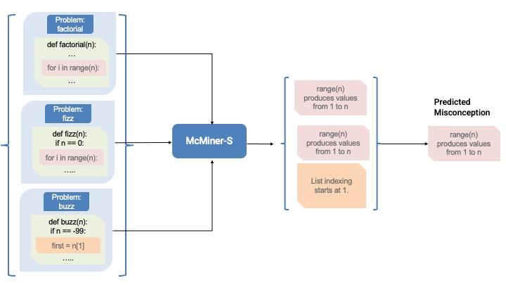

# McMiner

The goal of this project is to mine misconceptions from student code submissions and evaluate our approach on a realistic, diverse, and large benchmark. This repository contains tools and data for mining programming misconceptions from student code submissions.

## Data Sources

All artifacts used in this project are publicly available and properly licensed:

### Programming Problems and Solutions

The [Programming Problems and Solutions](dataset/problems_processed.json) dataset contains **501 problems** curated from multiple established sources to ensure diversity and representativeness. Each problem includes comprehensive test cases, with an average of **3.31 unit tests per problem** to validate correctness. The problems are sourced from:

- **[MBPP](https://github.com/google-research/google-research/tree/master/mbpp) (Mostly Basic Python Problems)** (438 problems, 87.4%): Licensed under CC BY 4.0 International license. Paper: [Program Synthesis with Large Language Models](https://arxiv.org/abs/2108.07732)
- **Socratic Debugging Dataset** (27 problems): Paper: [Can Language Models Employ the Socratic Method? Experiments with Code Debugging](https://dl.acm.org/doi/10.1145/3626252.3630799)
- **Auckland Dataset** (8 problems): Paper: [Common logic errors made by novice programmers](https://dl.acm.org/doi/10.1145/3160489.3160493)
- **FalconCode** (6 problems): Permissibly licensed for research purposes as described in the original paper (specific license details not publicly specified). The dataset was obtained by directly contacting the authors. Paper: [FalconCode: A Multiyear Dataset of Python Code Samples from an Introductory Computer Science Course](https://dl.acm.org/doi/10.1145/3545945.3569822)
- **Handwritten by Authors** (19 problems): Drawing inspiration from public programming courses and educational websites such as w3resource to fill gaps in programming language construct coverage

### Misconception Bank

The [Misconception Bank](dataset/misconception_bank.json) contains **67 misconceptions** covering various Python programming concepts, with our benchmark containing **1,063 code samples** exhibiting those misconceptions. The misconceptions were adapted from the following sources by directly reading them from the website or paper and handwriting misconceptions such that they fit our misconception description guidelines mentioned in the paper:

- **[Python Programming Misconception Bank](https://progmiscon.org/misconceptions)** (17 misconceptions): Paper: [A  Curated Inventory of Programming Language Misconceptions](https://dl.acm.org/doi/10.1145/3430665.3456343)
- **SIDELib** (36 misconceptions): Paper: [SIDE-lib: A Library for Detecting Symptoms of Python Programming Misconceptions](https://dl.acm.org/doi/10.1145/3587102.3588838)
- **Handwritten by Authors** (14 misconceptions): Including 3 out-of-domain misconceptions to test the ability of misconception mining tools to identify previously unseen patterns:
  1. *Student believes that every variable must be explicitly deleted with 'del' after its last use to prevent memory leaks*
  2. *Student believes that variable names containing vowels (a, e, i, o, u) can only store string values, while consonant-only names can store any type*
  3. *Student believes that list indexing starts at -1*

All artifacts mentioned above were adapted and modified through hand-edits made by the authors, then processed using Python scripts and LLMs in the form of the McInject and McMiner tools. The benchmark can be easily extended given any new misconception.

### Data Availability Summary

All datasets and artifacts used in this project are:
- Available on public webpages
- Described in the associated research papers
- From datasets that are permissibly licensed for research purposes

## McMiner-S Tool

The McMiner-S tool uses a single-instance mining approach to identify programming misconceptions from individual code samples and then aggregates the misconceptions from multiple code samples and selects the misconception that occurs most frequently as shown in the figure below.

---

## License

Everything in this repository, including all data and software, is released under the MIT License. See the [LICENSE](LICENSE) file for details.
